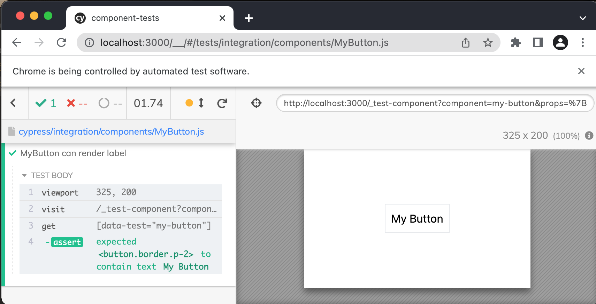

# CyCo

## Cypress Component Testing

CyCo is a nuxt module that facilitates component developement and testing using Cypress.

- Render single components with props
- Test a component with Cypress

## Installation

```
yarn add -D cyco
```

`cypress/support/index.js`

```
import "cyco/cypress/support";
```

## Workflow

### Create a component

```
/components/MyButton.vue

<template>
  <button data-test="my-button">{{ label }}</button>
</template>

<script>
export default {
  props: ["label"],
};
</script>
```

### Create a component test

```
/cypress/integration/components/MyButton.js

it("MyButton can render the label", () => {
  const label = "My Button";
  const props = { label };
  cy.testComponent("my-button", props)
    .get('[data-test="my-button"]')
    .should("contain.text", label);
});
```

> Notice how this method is available to test a component and pass it props:
> `cy.testComponent(componentName: String, props: Object)`

### Run spec to view single component



### Iterate on component tests and development
